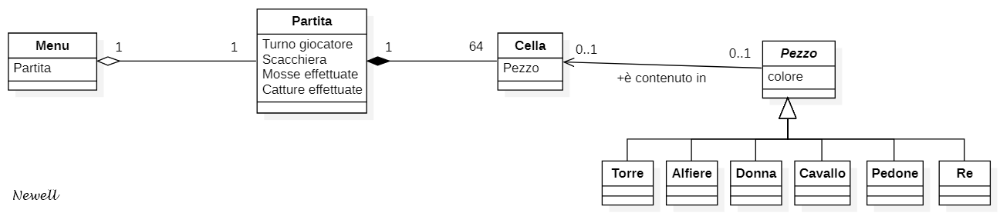
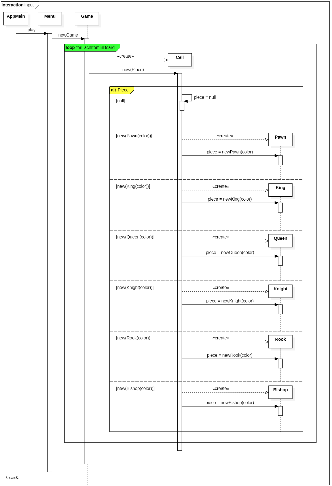

# RELAZIONE TECNICA FINALE 
# Progetto scacchi | a.a. 19-20

# *Gruppo Newell*

## 1. Introduzione ##
Gli **scacchi** sono un gioco di strategia che si svolge su una tavola quadrata detta scacchiera, formata da 64 caselle (o "case") di due colori (alternativamente di colore chiaro e scuro), sulla quale ogni giocatore dispone di 16 pezzi (bianchi o neri; per traslato, "il Bianco" e "il Nero" designano i due sfidanti): un re, una donna (o "regina"), due alfieri, due cavalli, due torri e otto pedoni.

 
 

&nbsp;Pedone &emsp;&emsp; Cavallo&emsp;&emsp;&nbsp; Alfiere &emsp;&emsp;&nbsp;&nbsp; Torre&emsp;&emsp;&emsp; Donna&emsp;&emsp;&emsp;&nbsp;Re

Fra i giochi più popolari al mondo, possono essere giocati ovunque (a livello ricreativo o agonistico): in casa, nei circoli dedicati, via Internet e talora per corrispondenza. Perfino agli albori della tecnologia era possibile giocare agli scacchi, ciò è dovuto al vantaggio di poter usare la [notazione algebrica](https://it.wikipedia.org/wiki/Notazione_algebrica), senza dover disporre necessariamente di un supporto grafico.

Il gioco degli scacchi è alquanto complesso, infatti si stima che il numero di combinazioni legalmente ammesse dei 32 pezzi sulle 64 case della scacchiera sia compreso fra 10⁴³ e 10⁵⁰. Numerose anche le [regole](https://it.wikipedia.org/wiki/Scacchi#Descrizione_e_regolamento) che governano le possibili scelte dei giocatori.

L'applicazione sviluppata permette di giocare una partita di scacchi sullo stesso terminale a linea di comando, facendo uso della suddetta notazione algebrica ridotta. È richiesto che i giocatori si alternino fisicamente nel digitare i comandi al fine di garantire il cambio di turno (mostrato a video).

## 2. Modello di dominio ##

## 3. Requisiti specifici

## 4. System Design

## 5. OO Design

