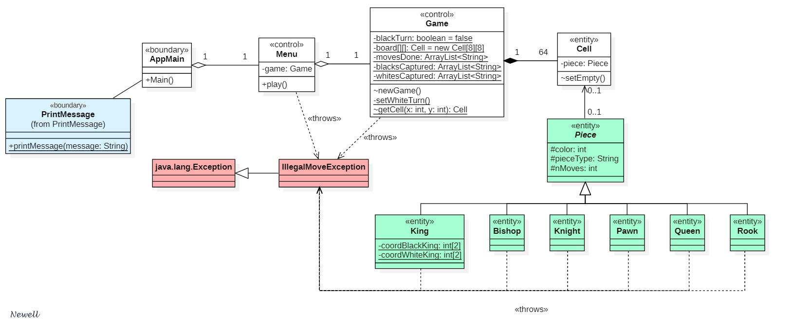

# RELAZIONE TECNICA FINALE 
# Progetto scacchi | a.a. 19-20

# *Gruppo Newell*

## Indice

1. [Introduzione](#introduzione)

2. [Modello di dominio](#modello_dominio)

3. [Requisiti specifici](#requisiti_specifici)

   - [Requisiti funzionali](#rf)
   - [Requisiti non funzionali](#rnf)

4. [System Design](#system_design)

5. [OO Design](#oo_design)

   - [User story: play](#play)
   - [User story: arrocco lungo](#arr_lun)
   - [Analisi](#oo_analisi)
   - [Design pattern](#design_pattern)

6. [Riepilogo dei test](#test)

7. [Manuale utente](#manuale_utente)

8. [Processo di sviluppo e organizzazione del lavoro](#sviluppo_lavoro)

9. [Analisi retrospettiva](#analisi_retrospettiva)

   

## 1. Introduzione <a name="introduzione" /> ##

Gli **scacchi** sono un gioco di strategia che si svolge su una tavola quadrata detta scacchiera, formata da 64 caselle (o "case") di due colori (alternativamente di colore chiaro e scuro), sulla quale ogni giocatore dispone di 16 pezzi (bianchi o neri; per traslato, "il Bianco" e "il Nero" designano i due sfidanti): un re, una donna (o "regina"), due alfieri, due cavalli, due torri e otto pedoni.

 
 

&nbsp;Pedone &emsp;&emsp; Cavallo&emsp;&emsp;&nbsp; Alfiere &emsp;&emsp;&nbsp;&nbsp; Torre&emsp;&emsp;&emsp; Donna&emsp;&emsp;&emsp;&nbsp;Re

Fra i giochi più popolari al mondo, possono essere giocati ovunque (a livello ricreativo o agonistico): in casa, nei circoli dedicati, via Internet e talora per corrispondenza. Perfino agli albori della tecnologia era possibile giocare agli scacchi, ciò è dovuto al vantaggio di poter usare la [notazione algebrica](https://it.wikipedia.org/wiki/Notazione_algebrica), senza dover disporre necessariamente di un supporto grafico.

Il gioco degli scacchi è alquanto complesso, infatti si stima che il numero di combinazioni legalmente ammesse dei 32 pezzi sulle 64 case della scacchiera sia compreso fra 10⁴³ e 10⁵⁰. Numerose anche le [regole](https://it.wikipedia.org/wiki/Scacchi#Descrizione_e_regolamento) che governano le possibili scelte dei giocatori.

L'applicazione sviluppata permette di giocare una partita di scacchi sullo stesso terminale a linea di comando, facendo uso della suddetta notazione algebrica ridotta. È richiesto che i giocatori si alternino fisicamente nel digitare i comandi al fine di garantire il cambio di turno (mostrato a video).

## 2. Modello di dominio <a name="modello_dominio" /> ##

## 3. Requisiti specifici <a name="requisiti_specifici" />

##### REQUISITI FUNZIONALI <a name="rf" />

In qualità di utilizzatore dell’applicazione voglio...

- visualizzare l’elenco dei comandi- iniziare una nuova partita

- chiudere l’applicazione

In qualità di giocatore qualsiasi voglio...

  - visualizzare la cronologia delle mosse giocate da entrambi i giocatori

  - visualizzare i pezzi catturati da me e dall’avversario

  - visualizzare la scacchiera

  - visualizzare il turno corrente

In qualità di giocatore, dopo aver scelto il mio colore, voglio...

- muovere un Pedone alleato

- effettuare una cattura semplice con un Pedone alleato

- effettuare una cattura en passant con un Pedone alleato

- muovere una Donna alleata

- catturare con una Donna alleata

- muovere un Cavallo alleato

- catturare con un Cavallo alleato

- muovere un Alfiere alleato

- catturare con un Alfiere alleato

- muovere una Torre alleata

- catturare con una Torre alleata

- muovere il Re alleato

- catturare con il Re alleato

- effettuare l’arrocco lungo/corto

…in modo tale da giocare una partita contro un altro giocatore.

##### REQUISITI NON FUNZIONALI <a name="rnf" />

- il sistema non deve permettere l’esecuzione di comandi di gioco mentre non si è in partita (quali mosse, catture, arrocco, ecc…)

- il sistema deve verificare che tutte le mosse ricevute siano legali (ovvero che seguano le regole degli scacchi): in caso di mossa illegale, deve permettere all’utente di eseguire un ulteriore tentativo

- il sistema deve permettere la creazione di una nuova partita in qualsiasi momento

- il sistema deve permettere la chiusura dell’applicazione in qualsiasi momento

- il sistema deve permettere a due giocatori diversi di giocare dallo stesso terminale

- il sistema deve permettere di giocare una partita con interfaccia a linea di comando

- il sistema deve essere containerizzabile

- l’applicazione deve essere eseguibile da terminale di Linux, Mac OS, Git (Git Bash) e Windows (powershell)

- il sistema deve evitare l’interruzione casuale dell’esecuzione a causa di errori

- il sistema deve essere user-friendly

- il sistema deve presentare una adeguata documentazione in modo tale da permetterne la manutenzione

  

## 4. System Design <a name="system_design" />

Lo stile architetturale scelto è il Layered con stratificazione lasca. Attraverso una breve riunione di gruppo, i componenti si sono trovati d’accordo sull’adottare questo stile data la bassa complessità del sistema (assenza di interazione client-server tra i componenti, unicità della rappresentazione visuale dei dati, ridotta quantità di classi e package). 

Il progetto è stato riadattato a posteriori per renderlo conforme a tale stile e risulta così impostato:

- al componente AppMain (**User Interface**) è stato affidato il compito di comunicare con l’utente attraverso CLI;

- PrintMessage (**Presentation**) è usato come componente per la presentazione dei dati della partita o dei vari messaggi di comunicazione/errore;

- il componente Menu (**Application**) viene utilizzato da AppMain. Effettua una prima “setacciatura” del tipo di funzioni (funzioni di spostamento/cattura di pezzi o funzioni di visualizzazione delle informazioni della partita) da eseguire in base all’input ricevuto dall’utente, coordina perciò il livello sottostante;

- Al livello **Domain** sono posti vari componenti:

   - Game fornisce servizi legati alla partita* ed ha la responsabilità di richiedere dati e servizi offerti dai suoi componenti inferiori (riguardanti i singoli pezzi o le singole celle);

   - Cell è un'entità usata per mettere in relazione il componente superiore Game col componente inferiore Piece;

   - Piece è un macro-componente atto a realizzare e fornire tutti i servizi dei pezzi della scacchiera. È pertanto composto da vari sottocomponenti ognuno dei quali rappresenta il singolo pezzo.

Il processo di interazione generale tra i vari componenti è il seguente:

1. AppMain riceve un input dall'utente e lo analizza:

    - se si tratta di un servizio di visualizzazione dati della partita richiama il relativo servizio da PrintMessage
    - altrimenti invia l'input ricevuto a Menu

2. Menu elabora l'input cercando di individuare uno dei possibili servizi richiesti. 

   - In caso non ci sia alcuna corrispondenza con i servizi offerti restituisce un errore

   - In caso di corrispondenza invece richiama il servizio dal componente sottostante Game

3. Game analizza la richiesta effettuata da Menu. Se si tratta di un servizio che può offrire esso stesso restituisce il risultato dell'operazione*. In caso contrario individua quale dei sottocomponenti di Piece utilizzare per soddisfare la richiesta e ne richiama i servizi.

4. Infine il sottocomponente di Piece porta a compimento l'operazione e ne restituisce il risultato.

5. Qualsiasi sia il risultato o l'esito restituito da un componente, al termine dell'operazione, esso viene "passato" al componente superiore, iniziando una "scalata" fino ad arrivare al componente AppMain che sfrutta l'ausilio di PrintMessage per comunicare l'esito della richiesta.

**la classe Game a inizio progetto era stata pensata per contenere molteplici funzioni tra cui crea nuova partita, importa partita, salva partita ecc. La funzione realizzata è stata solo quella di creazione di una nuova partita ma si è deciso di lasciare invariato il componente Game e le sue responsabilità al fine di evitare cambiamenti drastici a termine del ciclo di sviluppo del software.*

Il progetto finale ottenuto rispetta pertanto tutti i principi cardine della progettazione architetturale del Software assicurando una netta separazione di interessi tra i vari componenti (garantito dall'adozione dell'architettura Layered), alta coesione nei vari componenti che hanno proprie responsabilità distinte, basso accoppiamento tra i vari componenti (in quanto ognuno di essi fa affidamento sul messaggio ricevuto dallo strato superiore per elaborare i propri dati) e information hiding (ogni livello lavora senza conoscere la struttura degli altri livelli, infatti le interazioni tra i vari strati sono basati sulla comunicazione dell'input dell'utente [richieste] o del risultato dell'operazione [risposte]).

Di seguito è riportato il diagramma dei componenti dell'unico package del sistema:

## 5. OO Design <a name="oo_design" />

Si riportano di seguito i diagrammi delle classi e di sequenza per la creazione di una nuova partita e per l'esecuzione dell'arrocco lungo.

È inoltre allegato il [diagramma delle classi](https://i.ibb.co/QCmLQjV/diagramma-classi.png) dell'intero progetto JAVA.

**Play** <a name="play" />

Diagramma delle classi:

Diagramma di sequenza:

**Arrocco Lungo** <a name="arr_lun" />

Diagramma delle classi:

Diagramma di sequenza:

**Analisi** <a name="oo_analisi" />

Il progetto rispetta tutti i principi cardine dell'Object Oriented Design, in particolare:

- l'alta coesione è rispettata in tutte le classi che hanno scopi ben precisi ovvero:
  - AppMain si interfaccia con l'utente e riceve gli input;
  - PrintMessage comunica ogni tipo di messaggio all'utente;
  - Menu racchiude tutti i comandi generali del menu e li distingue dalle mosse;
  - Game contiene tutte le informazioni della partita in corso e richiama le mosse dei pezzi;
  - Cell contiene il pezzo (se esistente) presente in una cella;
  - Piece (e le sue sottoclassi) contiene le informazioni del pezzo e le sue possibili mosse;
- al fine di soddisfare il principio di separazione degli interessi sono stati eliminati tutti i messaggi di output dalle classi Game (di tipo entity) e Menu (di tipo control) che sono stati delegati alla nuova classe di tipo boundary PrintMessage
- l’information hiding è stato verificato in ogni classe, gli attributi sono stati resi tutti privati e accessibili tramite metodi getter/setter con l'adeguata visibilità. Ogni classe è, infatti, ignara del modo in cui sono implementate le altre classi
- anche il principio di basso accoppiamento è verificato in tutte le classi. L'esecuzione di ogni metodo infatti dipende soltanto dalla mossa ricevuta in input; l'output invece si basa sempre su un'eccezione lanciata dai metodi o da un array di stringhe di dimensione fissa 3 restituito da essi. In entrambi i casi l'output dei metodi è gestito soltanto dalla classe AppMain. L'implementazione della scacchiera attraverso matrice è anch'essa nascosta a tutte le classi che usano un metodo di accesso basato sulla cella che si vuole leggere/scrivere
- il progetto ha subito un refactoring generale durante lo Sprint 3 dovuto alla ripetizione di molte parti di codice. Dopo tale riscrittura generale del programma si è così potuto verificare anche il principio di Do Not Repeat Yourself che ha agevolato anche la fase di testing del progetto
- tutti i principi SOLID sono stati verificati, il gruppo si è focalizzato maggiormente sui due principi di Sostituzione di Liskov e di Inversione delle Dipendenze in quanto l'applicazione di entrambi i principi ha permesso di ridistribuire tutti i metodi che prima erano situati nella classe Game (metodi per cattura/spostamento) nelle varie classi dei singoli pezzi, verificando perciò anche il principio di alta coesione per tale classe
- si è optato per l’affidamento della gestione delle eccezioni alla classe AppMain che, con l'ausilio di PrintMessage, è in grado di comunicare all'utente l'esito della sua richiesta, che sia avvenuta con successo o meno

**Design pattern applicati** <a name="design_pattern" />

Builder: la rappresentazione della scacchiera (attributo board  in classe Game) è stata delegata al metodo printBoard appartenente alla classe PrintMessage al fine di separare l'implementazione di questo oggetto complesso dalla sua proiezione.

Abstract Factory: la classe Piece è stata resa astratta in modo da poterne implementare tutte le differenti sottoclassi che rappresentano i pezzi nella scacchiera (King, Pawn, Knight, Queen, Rook, Bishop).

Singleton: data l'unicità dell'entità "partita" nel programma si è deciso di rendere gli attributi di Game statici e di fornirne l'accesso attraverso metodi pubblici statici

## 6. Riepilogo dei test <a name="test" />

Numero dei casi di test:

Copertura dei casi di test:

## 7. Manuale utente <a name="manuale_utente" />

## 8. Processo di sviluppo e organizzazione del lavoro <a name="sviluppo_lavoro" />

Al fine di sviluppare il programma nel miglior modo possibile i componenti del gruppo hanno previsto:

1. Una riunione ad ogni inizio sprint al fine di suddividere i compiti tra i componenti, prefissare le date delle successive riunioni e organizzare le varie issue su GitHub
2. Una riunione a giorni alterni nel corso dello sprint al fine di verificare lo stato di esecuzione delle issue e ridistribuire, eventualmente, le attività
3. Una riunione al termine dello sprint al fine di revisionare, prima della consegna, tutte le attività svolte e portate a compimento

Tutte le riunioni hanno avuto durata media di 20-30 minuti, eccetto quelle di fine sprint durante le quali sono state impiegate in media 2 ore ciascuna al fine di ricontrollare tutti i progressi effettuati. I mezzi di comunicazione usati dal gruppo sono stati Microsoft Teams e Whatsapp, il primo per le riunioni di gruppo, il secondo per brevi avvisi a tutti i componenti.

Dopo aver impostato l'automazione dello sviluppo e del rilascio tramite Gradle e GitHub si è fin da subito applicato il principio di Continuous Integration, necessario durante tutta la durata del progetto in quanto molte attività erano dipendenti da altre. Attraverso tale metodo infatti è stato possibile rendere lo sviluppo del programma continuo, in modo da non dover attendere che altri componenti portassero a compimento le loro attività prima di iniziare con le proprie. Ciò è stato notevolmente utile soprattutto durante l'ultimo sprint in cui si è dovuto riscrivere per intero il codice.

Importante anche la presenza delle Sprint Board create su GitHub che hanno più volte agevolato il gruppo nello stabilire i tempi necessari a completare con successo uno sprint.

## 9. Analisi retrospettiva <a name="analisi_retrospettiva" />